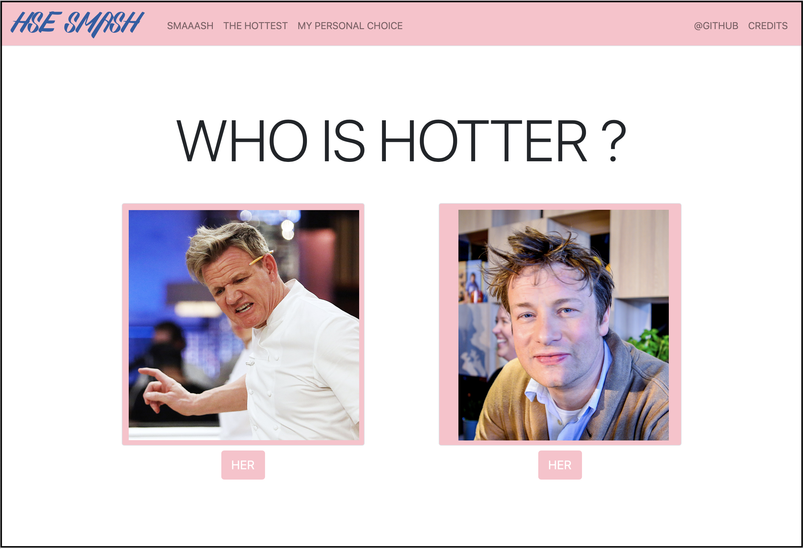

<a href='https://secure-island-71749.herokuapp.com'>
    
</a>

# HSE SMASH (CS50 Final Project)
[](https://www.python.org/downloads/release/python-360/)


[](https://opensource.org/licenses/MIT)

:star: Star me on GitHub — just for fun and motivation :grinning:

[HSE SMASH](https://secure-island-71749.herokuapp.com) is my final project for Harvard CS50 online course. It is a web app that allows you to compare girls by there profile photos & find the hottest one :fire: :fire: :fire: :fire: :smirk: :smirk: :smirk: :smirk:

<a href='https://secure-island-71749.herokuapp.com'>
    
</a>

## Table of contents

-   [Idea](#idea)
-   [Structure](#structure)
    -   [Database](#phpLiteAdmin)
    -   [VK](#vk)
    -   [Application](#application.py)

## Idea

The idea of making such an app came to me after watching ["The Social Network"](https://www.imdb.com/title/tt1285016/) movie. Where Mark Zuckerberg gets pissed off by his ex girlfriend and, being a little bit drunk, creates FaceSmash, a web-app that allows to compare Harvard girls between each other, two at a time. 

I was not pissed by my ex, nor was I drunk, but decided to reimplement this app using Python as a backend language for my Flask Server and JS/HTML/CSS for my pages. Being a HSE student I have decided to use VK society for getting the profile pages of the girls from my university. 

Below I give a detailed description of all the project, so feel free to use it as a template for making such a prank in your own university :wink:

## Structure
```
├── phpLiteAdmin
│   └── HSE.db
├── VK
│   └── vk_export.py

├── application.py
├── member.py
├── templates
│   └── credits.html
│   └── hottest.html
│   └── index.html
│   └── layout.html
│   └── personal.html
├── static
│   ├── fonts
│   │   └── SexyShoutFreeFont.ttf
│   │   └── SexyShoutFreeFont.otf
│   └── Jobs.jpg
│   └── Jobs2.jpg
│   └── Slushi.jpg
│   └── scripts.js
│   └── styles.css
├── LICENSE
├── README.md

```

### phpLiteAdmin
Before writing my web app I need a database with my girls. For that I need to decide what tools to use and what fields to create for each member. 

I have decided to use [SQLite](https://www.sqlite.org/index.html) for this project and [phpLiteAdmin](https://www.phpliteadmin.org) for local management and testing. The latter was utilized for initial cretion of the db, table and fields, though it could be done programmatically in Python. Here is the link for how to start a local phpLiteAdmin server "https://bitbucket.org/phpliteadmin/public/wiki/NoWebserver". 

The snipet of resulting "members" table: 

| tab_id | vk_id | first_name | last_name       | sex | photo_link | rating |
| ------ | ----- | ---------- | --------------  | --- | ---------- | ------ |
| 	2	 | 270	 | Irina	  |   Rybakova	    | 1	  | https://pp.userapi.com/c629116/v629116270/14349/NivavpUia9k.jpg?ava=1	                    | 2.0 |
| 	5	 | 509	 | Alyona	  |   Vershinina	| 1	  | https://pp.userapi.com/c852128/v852128160/2b6c0/pnVQlSodoEE.jpg?ava=1	                    | 0.0 |
| 	7	 | 605	 | Lena	      |   Udodova	    | 1	  | https://sun1-11.userapi.com/kDDxts6O4jouBIScMt4iH7nRVT_JKxzKkv9gaw/_IWoF3dFzlA.jpg?ava=1	| 0.0 |
| 	8	 | 680	 | Katya	  |   Semenko	    | 1	  | https://pp.userapi.com/c627316/v627316680/43095/ZVEhuFxe59Y.jpg?ava=1	                    | 0.0 |
| 	9	 | 692	 | Liza	      |   Kulik	        | 1	  | https://pp.userapi.com/c630416/v630416692/7446/Rbatb84-q9k.jpg?ava=1	                    | 0.0 |
| 	13	 | 796	 | Alina	  |   Sazonova	    | 1	  | https://pp.userapi.com/c638923/v638923796/4ebfc/Pa1bYmNPZgE.jpg?ava=1	                    | 0.0 |
| 	16	 | 896	 | Olga	      |   Borodulina	| 1	  | https://pp.userapi.com/c313/u00896/a_2f90c1d9.jpg?ava=1	                                    | 0.0 |
| 	17	 | 905	 | Alina	  |   Yashina	    | 1	  | https://pp.userapi.com/c824504/v824504324/1a43e4/x0DNcr_UhG0.jpg?ava=1	                    | 0.0 |

### VK

### application.py

